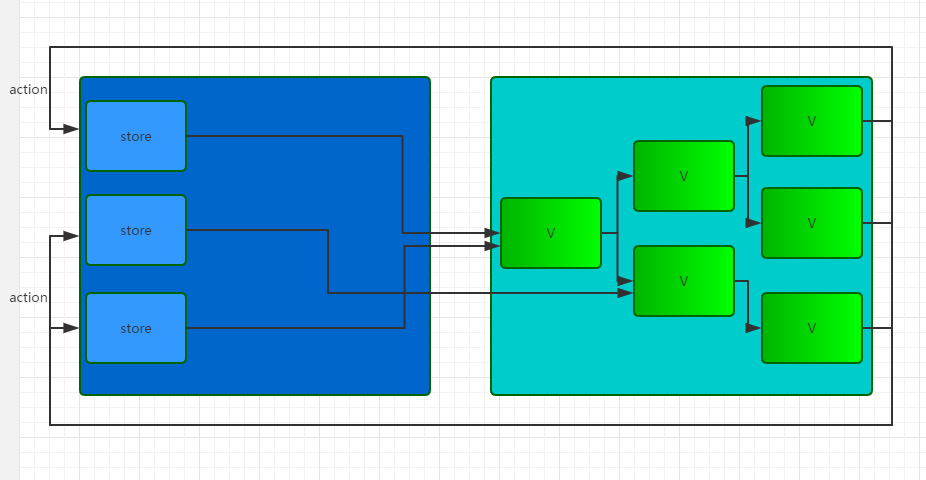
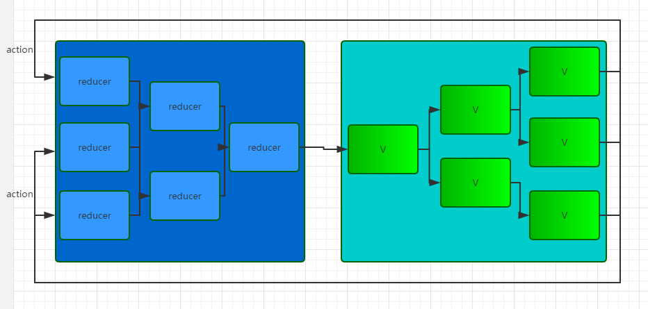

## Redux

#### Redux概念

> Redux 是一个给 JS 应用开发的可预测状态管理器，它可以帮助你写行为一致的应用程序，可以运行在不同的环境下运行(客户端，服务器，原生等)并且非常容易测试，除此之外，它还提供了良好的开发体验，比如结合了实时代码编辑和时间旅行调试器。

你可以把 Redux 和 React 一起使用，或者其它一些库，Redux 非常小只有 2kB.

简单地说: Redux 是一个受到了 Flux 模式启发的应用构架实现。

#### 啥是 Flux 模式？ 

Flux 是 Facebook 使用的一套前端应用的架构模式。Flux 的核心是"单向数据流" 运作是这样的:

> Action -> Dispatcher -> Store -> View

一个 Flux 应用主要包含四个部分:

- **Dispatcher**: 处理动作分发，维护 Store 之间的依赖关系.
- **Stores**: 数据和逻辑部分.
- **View**: 组件作为视图同时响应用户交互.
- **Actions**: 提供给 Dispatcher 传递数据给 Store.


Flux 模式的经典模式图

- 首先要有 action，通过定义一些 action creator 方法根据需要创建 Action 提供给 dispatcher
- View 层通过用户交互（比如 onClick）会触发 Action
- Dispatcher 会分发触发的 Action 给所有注册的 Store 的回调函数
- Store 回调函数根据接收的 Action 更新自身数据之后会触发一个 change 事件通知 View 数据更改了
- View 会监听这个 change 事件，拿到对应的新数据并更新组件 UI 里面的 State.

#### Redux 和 Flux 有什么不同?

上图 Flux 就已经很像 Redux 了,那他们之间有什么不同呢？

- Redux 只有一个 store

Flux 里面会有多个 store 存储应用数据，并在 store 里面执行更新逻辑，当 store 变化的时候再通知 controller-view 更新自己的数据，Redux 将各个 store 整合成一个完整的 store，并且可以根据这个 store 推导出应用完整的 state。同时 Redux 中更新的逻辑也不在 store 中执行而是放在 reducer 中。

- Redux 没有 Dispatcher

Redux 中没有 Dispatcher 的概念，它使用 reducer 来进行事件的处理，reducer 是一个纯函数，这个函数被表述为 `(previousState, action) => newState`，它根据应用的状态和当前的 action 推导出新的 state。Redux 中有多个 reducer，每个 reducer 负责维护应用整体 state 树中的某一部分，多个 reducer 可以通过 combineReducers 方法合成一个根reducer，这个根reducer负责维护完整的 state，当一个 action 被发出，store 会调用 dispatch 方法向某个特定的 reducer 传递该 action，reducer 收到 action 之后执行对应的更新逻辑然后返回一个新的 state，state 的更新最终会传递到根reducer处，返回一个全新的完整的 state，然后传递给 view。

在我看来，Redux 和 Flux 之间最大的区别就是对 store/reducer 的抽象，Flux 中 store 是各自为战的，每个 store 只对对应的 controller-view 负责，每次更新都只通知对应的 controller-view；而 Redux 中各子 reducer 都是由根reducer统一管理的，每个子reducer的变化都要经过根reducer的整合。用图表示的话可以像这样：

**Flux**



**Redux**




#### Vuex 和 Redux 的区别？


Vuex 其实也是 Flux 的一个实例，主要是为了配合 Vue 本身的响应式机制而做的。非常之像 Redux 比如单状态树和便于测试和热重载的 API，但是也选择性的放弃了一些在 Vue 的场景下并不契合的特性，比如强制的 immutability 等等。

所以如果 Vue + Vuex 契合度会更加贴合，也不需要考虑什么性能问题，缺点就是 Vuex 不像 Redux 可以更动态地可以和其它框架配合。

### 那么 Redux 是如何实现的？

#### 1. Redux 状态管理器

想一下 Redux 其实就是一个状态管理器, 比如 state 里面的一个状态count
```js
let state = {
  count: 1
}
```

输出状态
```js
console.log(state.count) // 1
state.count = 2 // 修改状态 
console.log(state.count) // 2 状态变化
```

上面是最简单的状态管理情况。我们可以试一下加入"发布-订阅模式"来解决这个问题。


```js
// publish.js

let state = {
  count: 1
}

let listeners = []

function subscribe(listener) {
  listeners.push(listener)
}

function changeCount(count) {
  state.count = count
  for (let i = 0; i < listeners.length; i++) {
    const listener = listeners[i]
    listener()
  }
}

```

```js
// subscribe.js
subscribe(() => {
  console.log(state.count)
})

changeCount(2)
changeCount(3)
changeCount(4)
```

可以看到上面代码，只要每次修改 state 里面的内容就会及时反应出来，但是有问题上面的 state 不是公共的，下面我们把公共代码抽出来，把 state 独立出来。

```js
// store.js

const createStore = function (initState) {
  let state = initState;
  let listeners = [];

  /*订阅*/
  function subscribe(listener) {
    listeners.push(listener);
  }

  function changeState(newState) {
    state = newState;
    /*通知*/
    for (let i = 0; i < listeners.length; i++) {
      const listener = listeners[i];
      listener();
    }
  }

  function getState() {
    return state;
  }

  return {
    subscribe,
    changeState,
    getState
  }
}

```

```js
let initState = {
  counter: {
    count: 0
  },
  info: {
    name: '',
    description: ''
  }
}

let store = createStore(initState);

store.subscribe(() => {
  let state = store.getState();
  console.log(`${state.info.name}：${state.info.description}`);
});
store.subscribe(() => {
  let state = store.getState();
  console.log(state.counter.count);
});

store.changeState({
  ...store.getState(),
  info: {
    name: 'igola',
    description: '前端'
  }
});

store.changeState({
  ...store.getState(),
  counter: {
    count: 1
  }
});
```
像上面一样这就会顺眼很多了 State 为公共的 state， `changeState` 函数可以很好的修改 state 的状态。
下面我们用上面的状态管理器来实现一个自增，自减的计数器。我们把 `changeState` 名字改成 `dispatch`, 建立一个 `plan` 来管理 `dispatch`

```js
// store.js
const createStore = function(plan, initState) {
  let state = initState
  let listeners = []

  function subscribe(listener) {
    listeners.push(listener)
  }

  function dispatch(action) {
    state = plan(state, action)
    for (let i = 0; i < listeners.length; i++) {
      const listener = listeners[i]
      listener()
    }
  }

  function getState() {
    return state
  }

  return {
    subscribe,
    dispatch,
    getState
  }
}
```

```js
// plan.js
// action = {type: '', other: ''}, action 必须有一个 type 属性来区分不同步骤的调用方法。
function plan(state, action) {
  switch: (action.type) {
    case 'INCREMENT':
      return {
        ...state,
        count: state.count + 1
      }
    case 'DECREMENT':
      return {
        ...state,
        count: state.count - 1
      }
    default: 
      return state
  }
}
```

```js
// index.js
let initState = {
  count: 0
}
let store = createStore(plan, initState)

store.subscribe(() => {
  let state = store.getState()
  console.log(state.count)
})

store.dispatch({type: 'INCREMENT'}) // 1
store.dispatch({type: 'DECREMENT'}) // 0
store.dispatch({count: 'abc' })
store.dispatch({type: 'INCREMENT', count: 3})
```

最后我们把 `plan` 改成 `reducer`, 这样就很像 Redux 的核心原理了, 当然 Redux 源码里面还有拆分合并`reducer` , 处理输入输出类型 Redux 中间件等内容，有兴趣可以具体看源码了。


### 阅读扩展
1. [fackbook Flux](https://facebook.github.io/flux/docs/in-depth-overview)

2. [浅谈 React、Flux 与 Redux](https://imweb.io/topic/57711e37f0a5487b05f325b5)


Clarence
